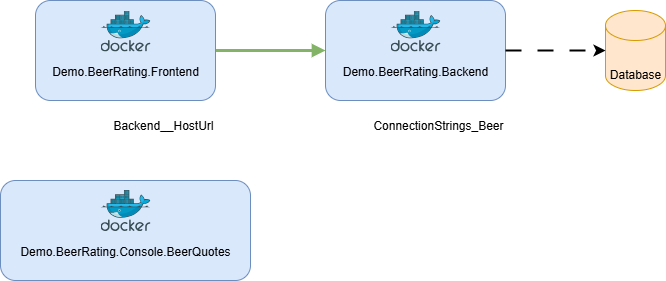

# beer-rating-standalone

This is a service-to-service sample application using a backend and a frontend, built with a .NET Web API and Blazor Server-Side with Razor Pages.

The application is a small beer rating application with a client-server architecture and a small dummy console application.

## Technology Stack

Applications:

- [Demo.BeerRating.Backend](src/Demo.BeerRating.Backend)
    - ASP.NET Web API
    - Entity Framework with SQL Server
- [Demo.BeerRating.Frontend](src/Demo.BeerRating.Frontend)
    - ASP.NET Razor Server Pages
- [Demo.BeerRating.Console.BeerQuotes](src/Demo.BeerRating.Console.BeerQuotes)
    - .NET Console

Framework and Tools:

- .NET 10
    - ASP.NET
    - Entity Framework
- Microsoft SQL Server
- Bicep

Connections:



## Run locally with compose file

1. Ensure [`docker compose`](https://docs.docker.com/compose/install/) or equivalent is available
2. Build container images

    ```bash
    scripts/01-build-images.sh
    ```

3. Run `docker compose up` from project root folder
4. Access applications via frontend: http://localhost:5179

## Development

### Run within Visual Studio Code

Start the application from the Debugging view. Run the `Full app` configuration to start all applications.

### Build images

> Ensure a builder for *amd64* and *arm64* is available.

Use the script `scripts/01-build-images.sh`.  
The script will create multiple tagged images for the applications:

    - `beer-rating-backend`
    - `beer-rating-frontend`
    - `beer-rating-console-beerquotes`
